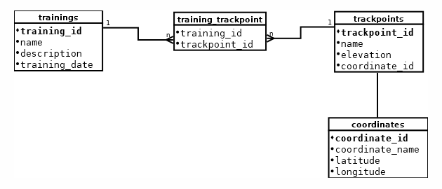

# Vizsgaremek

## Leírás

Az alkalmazás egy futónaplót modellez. Sokan, akik rendszeresen sportolnak (futnak) vezetik az edzéseiket, innen jött az ötlet. A cél egy olyan 
alkalmazás létrehozása volt, ami alkalmas futóedzések vezetésére. Konkrétan kiszámolja a betáplált útvonalat km-ben.

---

## Felépítés

### Coordinate

A `Coordinate` entitás a következő attribútumokkal rendelkezik:

* `id`
* `name` (nem lehet üres)
* `latitude` (az attribútumnak 40-50 közé kell esnie)
* `longitude` (az attribútumnak 15-25 közé kell esnie)

Végpontok:

| HTTP metódus | Végpont                       | Leírás                             |
|--------------|-------------------------------|------------------------------------|
| GET          | `"/api/coordinate"`           | lekérdezi az összes entitást       |
| GET          | `"/api/coordinate/{id}"`      | lekérdez egy entitást `id` alapján |
| POST         | `"/api/coordinate/create"`    | létrehoz egy új entitást           |
| PUT          | `"/api/coordinate/lat/{id}"`  | módosítja a latitude attribútumot  |
| PUT          | `"/api/coordinate/long/{id}"` | módosítja a longitude attribútumot |
| DELETE       | `"/api/coordinate/{id}"`      | töröl egy entitást `id` alapján    |

---

### TrackPoint

A `TrackPoint ` entitás a következő attribútumokkal rendelkezik:

* `id`
* `name` (nem lehet üres)
* `elevation` (nullától nagyobb legyen)

A `Coordinate` és a `TrackPoint` entitások között kétirányú, 1-1 kapcsolat van.

Végpontok:

| HTTP metódus | Végpont                  | Leírás                             |
|--------------|--------------------------|------------------------------------|
| GET          | `"/api/track"`           | lekérdezi az összes entitást       |
| GET          | `"/api/track/{id}"`      | lekérdez egy entitást `id` alapján |
| POST         | `"/api/track/create"`    | létrehoz egy új entitást           |
| PUT          | `"/api/track/name/{id}"` | módosítja a name attribútumot      |
| DELETE       | `"/api/track/{id}"`      | töröl egy entitást `id` alapján      |

Amikor lementek egy `TrackPointot` az adatbázisba, akkor egy `Coordinate` is lementődik hiszen ez a két entitás elválaszthatatlan
egymástól. 

---

### Training

A `Training ` entitás a következő attribútumokkal rendelkezik:

* `id`
* `name` (nem lehet üres)
* `description` (nem lehet üres)
* `date` (nem lehet nulla vagy üres)

A `Training` és a `TrackPoint` entitások között kétirányú, n-m kapcsolat van.

Végpontok:

| HTTP metódus | Végpont                          | Leírás                                           |
|-----------|----------------------------------|--------------------------------------------------|
| GET       | `"/api/training"`                | lekérdezi az összes entitást                     |
| GET       | `"/api/training/{id}"`           | lekérdez egy entitást `id` alapján               |
| GET       | `"/api/training/sum/{id}"`       | lekérdezi az edzés hosszát `id` alapján          |
| GET       | `"/api/training/elevation/{id}"` | lekérdezi az osszes szintemelkedést `id` alapján |
| POST      | `"/api/training/create"`         | létrehoz egy új entitást                         |
| DELETE    | `"/api/training/{id}"`           | töröl egy entitást `id` alapján                  |

A program kiszámolja az edzés hosszát (sum), az összes szintemelkedést (elevation), amiket a megfelelő végpontokon lehet
lekérdezni. Amikor lementek egy `Traininget` az adatbázisba, akkor a hozzá tartozó `TrackPointok` listája is bekerül az adatbázis trackpoints
táblájába, az ezekhez tartozó koordináták pedig a coordinates táblába.

---
A Coordinate és a TrackPoint között 1-1 kapcsolat van, a TrackPoint és a Training közöt pedig több-több kapcsolat,
ezért a közöttük lévő kapcsolatok felépítéséhez kapcsolótábla szükséges. A programhoz készült adatbázis adatbázis-diagramja ezen
az ábrán látható (DIA programmal készült):

---

## Technológiai részletek

A projekt egy klasszikus háromrétegű alkalmazást tartalmaz Java Spring backenddel, REST webszolgáltatásokkal, MariaDB
adatbázissal. Az SQL adatbázis kezelő réteg Spring Data JPA-val van megvalósítva. Az adatbázis
migrációt Flyway végzi. Az alkalmazás működését főleg integrációs tesztekkel (WebClient tesztek) ellenőriztem,
több mint 80%-os lefedettséget értem el. Az alkalmazáshoz SwaggerUI segítségével egy dinamikus dokumentációt is létrehoztam.

---
